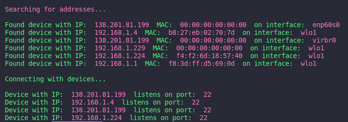

# ssh scan
This program is ideal for finding devices with ssh service running on the lan.
It displays a list of devices that use the port 22.

## compile and run
Compile the code
   ```
   make
   ```
Run the code 
   ```
   ./sshscan
   ```

## Screenshot

